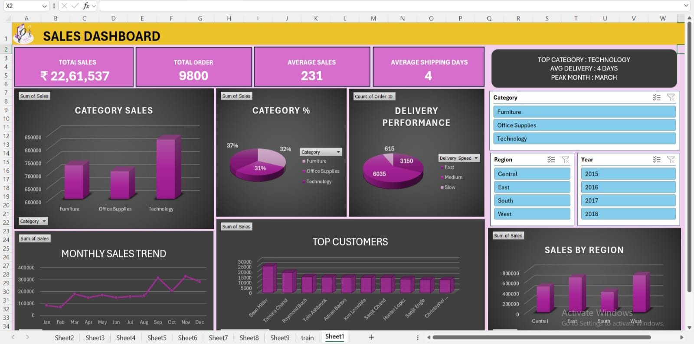

# 📊 Sales Dashboard Project (Excel)

## 📌 Overview
This project is an interactive **Sales Dashboard** built using Microsoft Excel.  
It analyzes sales performance, customer behavior, and delivery efficiency using a real-world dataset.

---

## 🎯 Objectives
- Analyze overall sales performance  
- Track monthly sales trends  
- Understand category-wise contribution  
- Evaluate delivery performance  
- Identify top customers and regions  

---

## 📂 Dataset
The dataset used in this project is sourced from Kaggle.

### 📌 Description
- Contains sales transaction data including orders, customers, categories, and shipping details  
- Used for analyzing sales performance and delivery efficiency  

> Note: Dataset is publicly available for learning purposes.

---

## 🧹 Data Cleaning Process
- Checked for missing values  
- Removed duplicate records to ensure accuracy  
- Cleaned and formatted data using Excel and Power Query  
- Converted date columns into proper format  
- Ensured consistency across all columns  

---

## 🔄 Data Transformation (Power Query)
- Used **Power Query Editor** for data preprocessing and transformation  
- Created a new column: **Shipping Days** (Delivery Date - Order Date)  
- Added a calculated column: **Delivery Speed** categorized as:
  - Fast  
  - Medium  
  - Slow  
- Standardized and structured the dataset for analysis  

---

## 📊 Dashboard Features

### 🔹 Key Metrics (KPIs)
- Total Sales: ₹22,61,537  
- Total Orders: 9800  
- Average Sales: 231  
- Average Shipping Days: 4  

### 🔹 Visual Insights
- Category-wise Sales Analysis  
- Sales Distribution by Category (%)  
- Monthly Sales Trend  
- Delivery Performance (Fast / Medium / Slow)  
- Top Customers Analysis  
- Sales by Region  

### 🔹 Filters (Slicers)
- Category  
- Region  
- Year  

---

## 📷 Dashboard Preview


---

## 📈 Key Insights
- Technology category generates the highest sales  
- Peak sales observed in November  
- Most deliveries fall under medium speed  
- Certain regions contribute significantly to revenue  

---

## 🚀 Conclusion
This dashboard provides meaningful insights into business performance and supports data-driven decision making.

---

## 🛠 Tools Used
- Microsoft Excel  
- Power Query  
- Pivot Tables  
- Pivot Charts  
- Slicers  

---

## 📁 Project Structure

```
sales-dashboard-excel/
│
│── Sales_Dashboard.xlsx  
│── image.jpeg  
│── README.md  
└── data/  
└── train.csv
```
