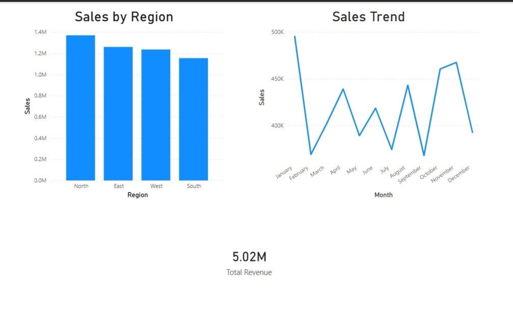

# 📊 Sales Data Analysis using Python & Power BI Dashboard

## 📌 Project Overview
This project analyzes sales data to understand regional performance, monthly trends, and overall business revenue.  
Data cleaning and analysis were performed using Python and Pandas in Jupyter Notebook.  
The final insights were visualized through an interactive dashboard created in Power BI.

---

## 🎯 Objectives

- Perform data cleaning and preprocessing  
- Calculate total sales revenue  
- Compare sales performance across regions  
- Identify monthly sales trends  
- Build a business dashboard for visualization  

---

## 🛠️ Tools Used

- Python  
- Pandas  
- Jupyter Notebook  
- Power BI  

---

## 🧹 Data Cleaning & Preparation

- Checked missing values using `df.isnull().sum()`  
- Removed null rows using `df.dropna()`  
- Converted `Sale_Date` column into datetime format  
- Extracted Month for trend analysis  

---

## 💰 Total Revenue

Total Revenue Generated:

**$5.02 Million**

---

## 🌍 Sales by Region

| Region | Sales |
|--------|------|
| North | Highest |
| East | Moderate |
| West | Moderate |
| South | Lowest |

---

## 📅 Monthly Sales Trend

- Peak Sales → October & November  
- Lowest Sales → February & September  
- Indicates seasonal business pattern  

---

## 📊 Power BI Dashboard

The dashboard includes:

- Bar Chart → Sales by Region  
- Line Chart → Monthly Sales Trend  
- KPI Card → Total Revenue  

### 🖼️ Dashboard Preview



---

## 💡 Business Insights

- North region is the strongest revenue contributor  
- South region needs targeted marketing strategy  
- Business demand increases during Q4  
- Low sales months require promotional planning  

---

## ▶️ How to Run This Project

1. Install pandas:

```
pip install pandas
```

2. Open Jupyter Notebook → Run analysis file  

3. Open Power BI `.pbix` file to view dashboard  

---

## 📁 Project Structure

```
Sales-Analysis/
│
├── sales_data.csv
├── sales_analysis.ipynb
├── sales_dashboard.pbix
├── sales_dashboard.png
└── README.md
```
